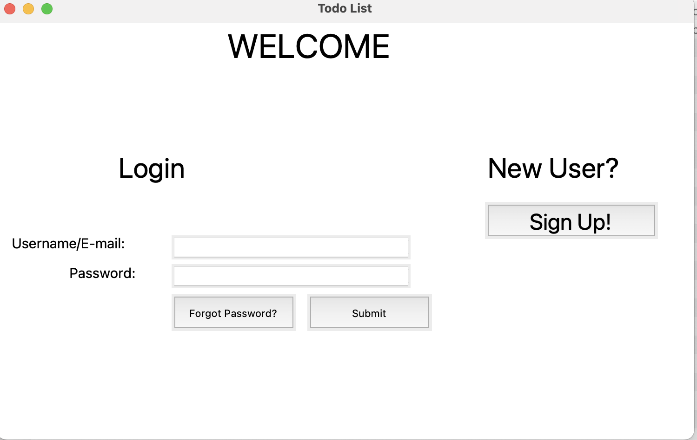

# Todo-Application

* A simple Todo application built using Tkinter and used to maintain our day-to-day tasks.
* The tasks are prioritised such that the most important tasks are at the top of the list, and the least important at the bottom of the list. 
* This application comes with an added functionality to send task completion reminders via email. 
